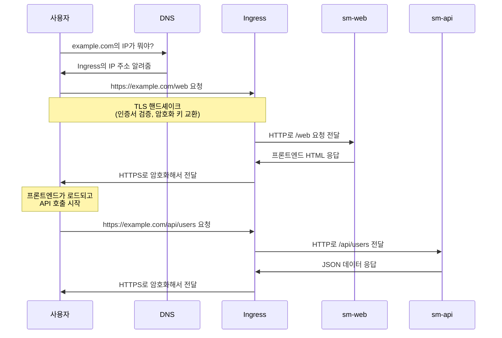

## 왜 Ingress를 써야 할까?

쿠버네티스에 프론트엔드와 백엔드를 배포하면서 하나의 도메인(example.com) 아래에서 HTTPS를 적용해야 하는 상황이었다. 

- `https://example.com/web` → 프론트엔드
- `https://example.com/api` → 백엔드

이처럼 경로(/web, /api)에 따라 트래픽을 나누는 라우팅이 필요했는데, LoadBalancer는 IP와 포트 단위로만 라우팅을 처리하기 때문에 이런 구분이 불가능했다.

또한 HTTPS를 적용하기 위해서는 TLS 인증서 관리가 필요한데, Ingress를 사용하면 TLS 종료(Termination)를 Ingress 레벨에서 처리할 수 있다.
덕분에 각 서비스는 HTTP만 처리하면 되고, 인증서도 중앙에서 관리할 수 있어 훨씬 효율적이다.

---

## Ingress Controller 설치 

Ingress 리소스만 만들면 작동하지 않는다. 실제로 트래픽을 처리할 **Ingress Controller**가 먼저 설치되어 있어야 한다.

Ingress 리소스는 단순히 "이런 규칙으로 라우팅해줘"라고 선언하는 것이고, 실제로 그 규칙을 실행하는 건 Controller다.

### Nginx Ingress Controller 설치

```bash
# Helm으로 설치 
helm repo add ingress-nginx https://kubernetes.github.io/ingress-nginx
helm repo update
helm install nginx-ingress ingress-nginx/ingress-nginx \
  --namespace ingress-nginx \
  --create-namespace

# 또는 kubectl로 설치
kubectl apply -f https://raw.githubusercontent.com/kubernetes/ingress-nginx/controller-v1.8.1/deploy/static/provider/cloud/deploy.yaml
```

**설치 확인:**

```bash
kubectl get pods -n ingress-nginx
kubectl get svc -n ingress-nginx
```

외부 IP가 할당될 때까지 기다린다 (클라우드 환경에서는 자동으로 LoadBalancer 생성):

```
NAME                                 TYPE           EXTERNAL-IP      PORT(S)
ingress-nginx-controller             LoadBalancer   34.123.45.67     80:31234/TCP,443:32567/TCP
```

---

## TLS 인증서 준비하기

HTTPS를 쓰려면 당연히 인증서가 필요하다.

### TLS와 CA

- **TLS (Transport Layer Security)**: 통신을 암호화하는 프로토콜
- **CA (Certificate Authority)**: 인증서를 발급해주는 신뢰할 수 있는 기관

CA가 "이 인증서는 진짜 example.com 거 맞아요"라고 보증해주는 거다. 브라우저는 이 CA를 신뢰하기 때문에, CA가 서명한 인증서를 받으면 자물쇠 아이콘을 띄워준다.

### 인증서 발급받기

프로덕션 환경이라면 보통 이런 식으로 진행된다:

1. CA에 인증서 발급 요청
2. 도메인 소유권 검증 (DNS TXT 레코드 추가 등)
3. 검증 완료되면 인증서 받기

Let's Encrypt를 쓰면 무료로 받을 수 있고, cert-manager를 쓰면 자동으로 갱신도 해준다. 이번에는 수동으로 받은 인증서를 사용했다.

### 쿠버네티스 Secret 생성하기

인증서를 받았으면 쿠버네티스 Secret으로 저장해야 한다.

```bash
kubectl create secret tls sm-tls-secret \
  --cert=tls.crt \
  --key=tls.key \
  -n dev
```

**Secret 확인:**

```bash
kubectl get secret sm-tls-secret -n dev
kubectl describe secret sm-tls-secret -n dev
```

---

## Ingress 설정하기

이제 본격적으로 Ingress를 설정해보자. 전체 구조를 한 번에 보면 이렇다.

### 전체 YAML 구성

```yaml
# 1. sm-web (프론트엔드) Deployment
apiVersion: apps/v1
kind: Deployment
metadata:
  name: sm-web
  namespace: dev
spec:
  replicas: 2  # 부하 분산을 위해 2개 실행
  selector:
    matchLabels:
      app: sm-web
  template:
    metadata:
      labels:
        app: sm-web
    spec:
      containers:
        - name: sm-web
          image: myrepo/sm-web:latest
          ports:
            - containerPort: 3000  # React 앱이 3000 포트에서 실행
          resources:
            limits:
              cpu: "500m"
              memory: "512Mi"

---
# 2. sm-web Service
apiVersion: v1
kind: Service
metadata:
  name: sm-web
  namespace: dev
spec:
  selector:
    app: sm-web
  ports:
    - protocol: TCP
      port: 80  # Service 포트
      targetPort: 3000  # 실제 컨테이너 포트
  type: ClusterIP  # 내부 전용

---
# 3. sm-api (백엔드) Deployment
apiVersion: apps/v1
kind: Deployment
metadata:
  name: sm-api
  namespace: dev
spec:
  replicas: 2
  selector:
    matchLabels:
      app: sm-api
  template:
    metadata:
      labels:
        app: sm-api
    spec:
      containers:
        - name: sm-api
          image: myrepo/sm-api:latest
          ports:
            - containerPort: 8080  # Spring Boot 기본 포트
          env:
            - name: DATABASE_URL
              value: "mysql://db-server:3306/mydb"
          resources:
            limits:
              cpu: "1000m"
              memory: "1Gi"

---
# 4. sm-api Service
apiVersion: v1
kind: Service
metadata:
  name: sm-api
  namespace: dev
spec:
  selector:
    app: sm-api
  ports:
    - protocol: TCP
      port: 80
      targetPort: 8080
  type: ClusterIP

---
# 5. Ingress 리소스 
apiVersion: networking.k8s.io/v1
kind: Ingress
metadata:
  name: sm-ingress
  namespace: dev
  annotations:
    nginx.ingress.kubernetes.io/rewrite-target: /
    nginx.ingress.kubernetes.io/ssl-redirect: "true"  # HTTP → HTTPS 자동 리디렉션
spec:
  ingressClassName: nginx
  tls:
    - hosts:
        - example.com
      secretName: sm-tls-secret  # 아까 만든 Secret
  rules:
    - host: example.com
      http:
        paths:
          - path: /web
            pathType: Prefix
            backend:
              service:
                name: sm-web
                port:
                  number: 80
          - path: /api
            pathType: Prefix
            backend:
              service:
                name: sm-api
                port:
                  number: 80
```

### 주요 설정 설명

#### 1. Service는 ClusterIP로

**트래픽 흐름:**
- 외부 → Ingress (HTTPS)
- Ingress → Service (HTTP, 내부 통신)
- Service → Pod (HTTP)

외부에서 직접 접근할 필요가 없으므로 ClusterIP로 충분하다.

#### 2. Ingress에서 TLS 설정

```yaml
spec:
  tls:
    - hosts:
        - example.com
      secretName: sm-tls-secret
```

이렇게 하면 Ingress가 **TLS 종료**를 처리한다.

- **외부 → Ingress**: HTTPS로 암호화된 통신
- **Ingress → Service**: HTTP로 평문 통신 (내부 네트워크라 괜찮음)

Ingress가 HTTPS를 HTTP로 변환해준다. 덕분에 각 서비스에서 TLS를 신경 쓸 필요가 없다.

#### 3. 경로 기반 라우팅

```yaml
paths:
  - path: /web
    pathType: Prefix
    backend:
      service:
        name: sm-web
        port:
          number: 80
  - path: /api
    pathType: Prefix
    backend:
      service:
        name: sm-api
        port:
          number: 80
```

`/web`로 시작하는 요청은 프론트엔드로, `/api`로 시작하는 요청은 백엔드로 보낸다. `pathType: Prefix`는 "이 경로로 시작하는 모든 요청"을 의미한다.

예를 들어:
- `https://example.com/web` → sm-web
- `https://example.com/web/dashboard` → sm-web
- `https://example.com/api/users` → sm-api
- `https://example.com/api/posts/1` → sm-api

#### 4. 어노테이션의 의미

```yaml
annotations:
  nginx.ingress.kubernetes.io/rewrite-target: /
  nginx.ingress.kubernetes.io/ssl-redirect: "true"
```

**rewrite-target 동작 방식:**

이 설정은 경로 prefix를 제거하고 뒷부분만 백엔드로 전달한다:

| 사용자 요청 | 백엔드로 전달되는 경로 |
|------------|---------------------|
| `/web` | `/` |
| `/web/dashboard` | `/dashboard` |
| `/api/users` | `/users` |
| `/api/posts/1` | `/posts/1` |


**ssl-redirect:**

HTTP로 접근하면 자동으로 HTTPS로 리디렉션한다.

---

## 실제 동작 흐름

실제로 사용자가 접속할 때 어떻게 동작하는지 정리해봤다:



핵심은:
1. DNS가 도메인을 Ingress IP로 변환
2. Ingress가 TLS 핸드셰이크를 처리 (인증서 검증, 암호화)
3. Ingress가 경로를 보고 적절한 Service로 라우팅
4. 내부에서는 HTTP로 통신 
5. 응답을 다시 HTTPS로 암호화해서 사용자에게 전달

---

## DNS 설정 - 마지막 단계

Ingress까지 다 설정했으면 마지막으로 DNS를 연결해야 한다.

### Ingress의 외부 IP 확인

```bash
kubectl get ingress sm-ingress -n dev
```

```
NAME          CLASS   HOSTS          ADDRESS          PORTS     AGE
sm-ingress    nginx   example.com    34.123.45.67     80, 443   10m
```

`ADDRESS` 필드에 외부 IP가 표시된다.

### DNS A 레코드 추가

도메인 관리 페이지(가비아, Route53 등)에 가서:

```
Type: A
Name: example.com (또는 @)
Value: 34.123.45.67
TTL: 300
```

이렇게 A 레코드를 추가하면 `example.com`이 Ingress의 IP로 연결된다.

DNS 전파에는 보통 5분~1시간 정도 걸릴 수 있다.

---

## 정리

쿠버네티스에서 HTTPS를 적용하는 과정을 정리하면:

1. **Ingress Controller 설치**
   - Nginx Ingress Controller 설치
   - LoadBalancer 생성 확인

2. **TLS 인증서 준비**
   - CA에서 인증서 발급받기
   - 도메인 소유권 검증 거치기

3. **Secret 생성**
   - `kubectl create secret tls` 명령어로 간편하게 생성

4. **Service 배포**
   - Deployment와 Service를 ClusterIP 타입으로 생성
   - targetPort를 컨테이너 포트와 맞추기

5. **Ingress 설정**
   - TLS Secret 참조
   - 경로 기반 라우팅 규칙 정의
   - 필요한 어노테이션 추가

6. **DNS 설정**
   - Ingress의 외부 IP 확인
   - 도메인 A 레코드 추가

Ingress를 직접 설정해보면서, 처음엔 구성 요소가 많아 복잡하게 느껴졌지만 결국 핵심은 단순했다.
Ingress는 서비스로 가는 진입점을 통합 관리해주는 역할이고, 그 위에서 TLS와 라우팅을 한 번에 처리해준다.

특히 HTTPS를 각 서비스에 따로 적용하는 대신 Ingress 레벨에서 통합 관리하니 배포와 유지보수가 훨씬 깔끔해졌다.

---

## 참고 자료

- [Kubernetes 공식 문서 - Ingress](https://kubernetes.io/docs/concepts/services-networking/ingress/)
- [Nginx Ingress Controller 가이드](https://kubernetes.github.io/ingress-nginx/)
- [cert-manager 공식 문서](https://cert-manager.io/)
- [Let's Encrypt - 무료 TLS 인증서](https://letsencrypt.org/)